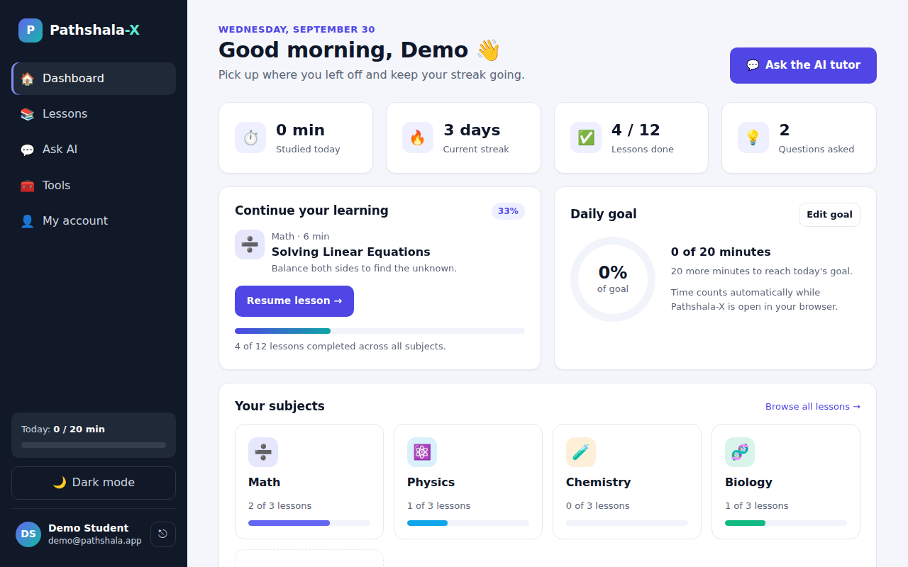
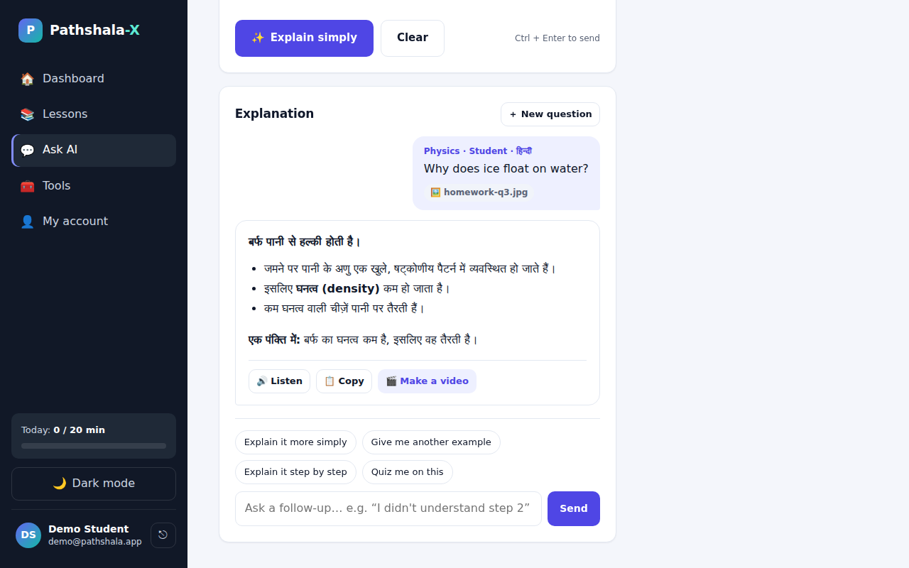
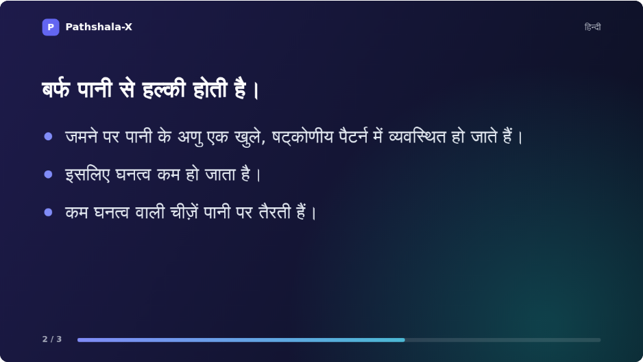
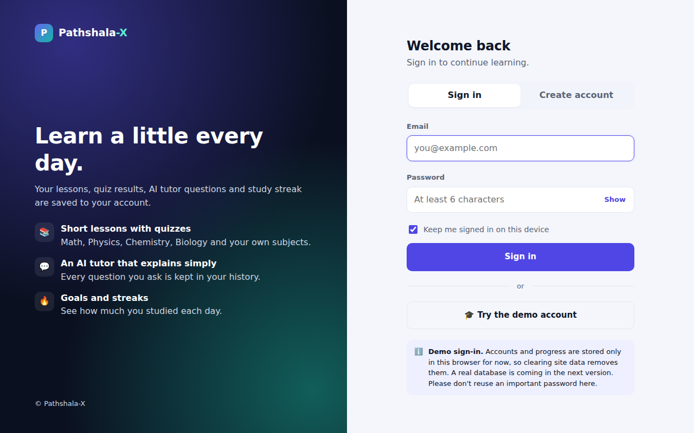
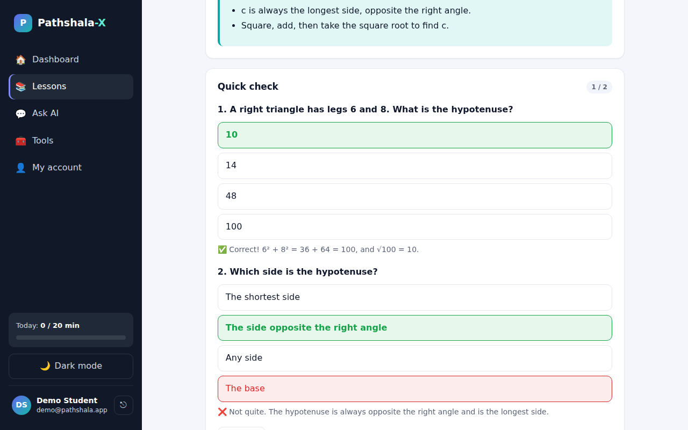
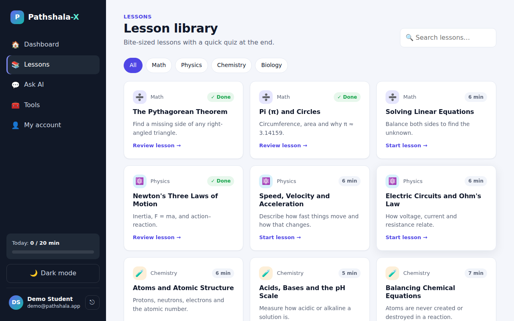
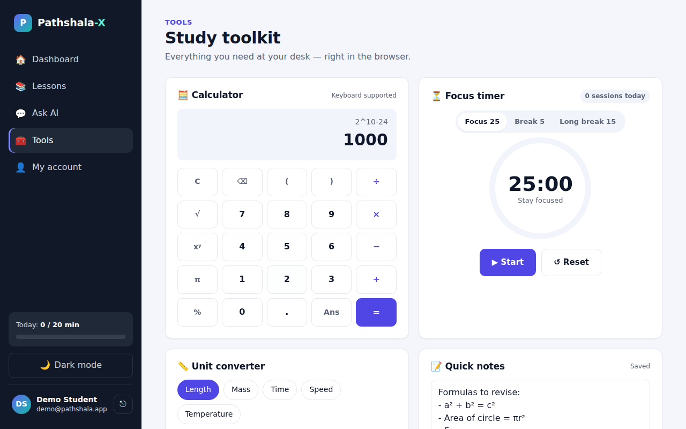
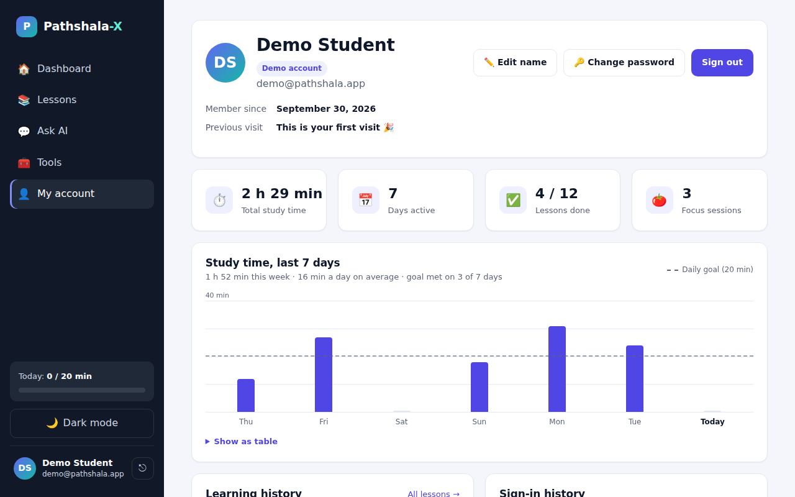
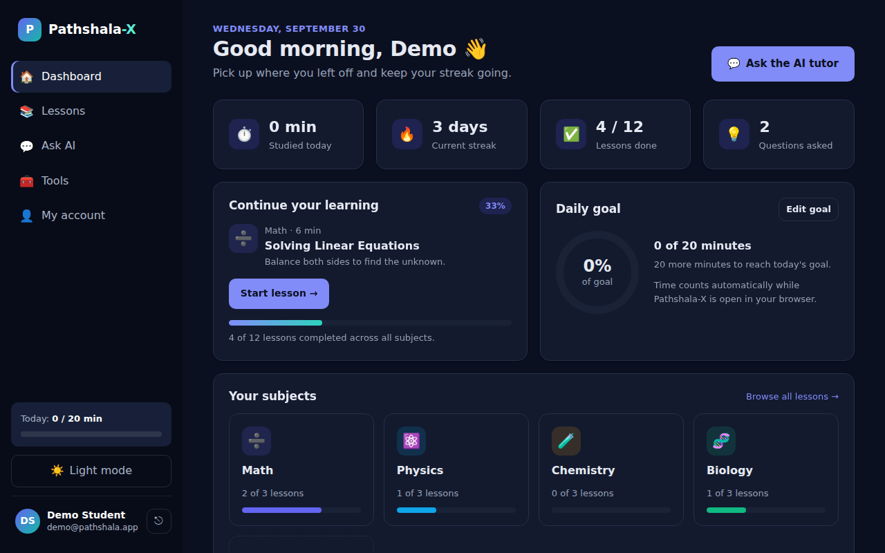
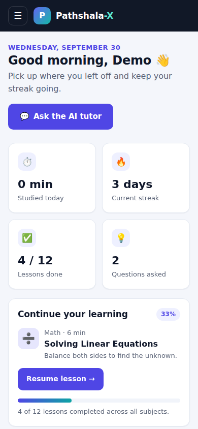

<div align="center">

# 📘 Pathshala-X

**A friendly learning companion for school students: short lessons, instant quizzes, an AI tutor that explains things simply in your own language (with voice and video), and study tools, all in the browser.**




</div>

---

## Contents

- [What is Pathshala-X?](#what-is-pathshala-x)
- [Features](#features)
- [Screenshots](#screenshots)
- [Quick start](#quick-start)
- [How to use it](#how-to-use-it)
- [Enabling the AI tutor](#enabling-the-ai-tutor)
- [Deploying to Vercel](#deploying-to-vercel)
- [Accounts & data (temporary demo)](#accounts--data-temporary-demo)
- [Project structure](#project-structure)
- [API reference](#api-reference)
- [Customising](#customising)
- [Troubleshooting](#troubleshooting)
- [Roadmap](#roadmap)

---

## What is Pathshala-X?

*Pathshala* (पाठशाला) means "school". Pathshala-X is a web app where a student can:

1. **Learn**: read short, clear lessons in Math, Physics, Chemistry and Biology.
2. **Check understanding**: answer a quick quiz at the end of every lesson.
3. **Ask**: type a question or snap a photo of it, and get a simple, step-by-step explanation from an AI tutor **in their own language**. They can ask follow-up questions, listen to the answer, or turn it into a short video.
4. **Stay on track**: daily study goals, streaks, a focus timer and notes.

It is built with plain **HTML, CSS and JavaScript**. There is no framework, no build step and no npm packages to install. Two small serverless functions talk to the OpenAI API: `api/explanation.js` for the tutor and `api/speech.js` for the AI voice.

---

## Features

### 🔐 Sign in & accounts
- Create an account with your name, email and password, or sign in.
- **One-click demo account** with sample progress already filled in, so you can explore straight away.
- Accounts already used in this browser appear on the login page for quick sign-in.
- "Keep me signed in" option, show/hide password, and friendly error messages.
- Every page except the login page requires sign-in, and each account's data is kept separate.

> ⚠️ Accounts are a **temporary demo**: they are stored in your browser, not in a database. See [Accounts & data](#accounts--data-temporary-demo).

### 🏠 Dashboard
- Greets you by name and shows when you last visited.
- **Live stats**: minutes studied today, current streak, lessons completed, questions asked.
- **Continue learning** takes you back to where you stopped.
- **Daily goal** ring with a goal you can edit (5–600 minutes).
- **Your subjects** shows progress per subject. You can add your own subjects (e.g. History) and remove them.
- **Recent activity**: completed lessons and questions you asked.

### 📚 Lessons
- **12 lessons** across 4 subjects, each with explanations, formulas, worked examples and key points.
- Filter by subject and search by keyword.
- **Quick-check quiz** at the end of each lesson, with instant feedback and an explanation for every answer.
- A perfect quiz score marks the lesson complete automatically. You can also mark it complete (or undo) by hand.
- "Next lesson" and "Ask AI about this" buttons on every lesson.

### 💬 Ask AI (tutor)
- **🌐 Explanations in your language**: choose from 23 languages, including English, Hindi, Telugu, Tamil, Kannada, Malayalam, Marathi, Bengali, Gujarati, Punjabi, Odia, Urdu, Spanish, French, Arabic, Chinese and Japanese. You can also pick **Other…** and type any language. Your choice is remembered.
- **📎 Upload files**: attach up to 3 **photos** (e.g. a picture of a homework question), **PDFs** or **text files** (`.txt`, `.md`, `.csv`). Drag & drop them, choose them, or **paste a screenshot** straight into the question box. Photos are resized automatically before upload.
- Choose a **subject** and **level**: *beginner*, *school student* or *exam revision*.
- Paste the answer from your textbook or teacher (optional), and the tutor breaks it down and corrects it if it's wrong.
- **💬 Follow-up questions**: the explanation becomes a conversation. Ask "I didn't understand step 2", or tap a quick option: *Explain it more simply*, *Give me another example*, *Explain it step by step*, *Quiz me on this*. The tutor remembers the earlier answers and your files.
- **🔊 Listen** on every answer: reads it aloud with a natural **AI voice** in the chosen language. If the AI voice isn't set up, your device's own voice is used instead.
- **🎬 Make a video** from any answer: an animated explainer with slides (the question, each key idea, and a one-line summary) **narrated in your language**. It's made in your browser and you can **download** it (`.webm`). See [How the explainer video works](#how-the-explainer-video-works).
- **📋 Copy** any answer.
- **History** of your last 30 conversations (with follow-ups and language); click one to open it again.
- **Works offline too**: if the AI service isn't available, you still get a built-in explanation in English (clearly labelled) that splits the answer into steps and links to a related lesson.
- Shortcut: **Ctrl + Enter** (⌘ + Enter on Mac) to send.

### 🧰 Tools
- **Calculator**: `+ − × ÷`, powers `xʸ`, `√`, `π`, `%`, brackets, `Ans`. Works with your keyboard (see [shortcuts](#keyboard-shortcuts)).
- **Unit converter**: length, mass, time, speed and temperature, with a swap button.
- **Focus timer (Pomodoro)**: 25-minute focus, 5-minute break, 15-minute long break, with a sound alert and a count of today's sessions.
- **Quick notes**: save automatically as you type, and can be downloaded as a `.txt` file.

### 👤 My account
- Edit your name and change your password.
- **Your past usage** at a glance: total study time, days active, lessons done, focus sessions.
- **Study-time chart for the last 7 days**, with your daily goal line, hover details and a "show as table" view.
- **Learning history** (lessons completed, questions asked) and **sign-in history** (date, time and device).
- **Download my data** (JSON) and **Delete account**.

### ✨ Everywhere
- **Light and dark mode** (follows your device by default and remembers your choice).
- **Works on phones**: the sidebar becomes a slide-out menu.
- Study time is **tracked automatically** while the app is open and visible.
- Accessible: keyboard navigation, focus outlines, screen-reader labels, and reduced motion when your device asks for it.

---

## Screenshots

| **Ask AI: Hindi answer, photo upload, follow-ups** | **Explainer video (narrated in Hindi)** |
| :---: | :---: |
|  |  |
| **Login** | **Lesson quiz** |
|  |  |
| **Lesson library** | **Study tools** |
|  |  |
| **My account & usage history** | **Dark mode** |
|  |  |
| **On a phone** | |
|  | |

---

## Quick start

### Option 1: Run it with Node.js (recommended)

You need **[Node.js](https://nodejs.org) 18 or newer**. There's nothing to install beyond that.

```bash
git clone https://github.com/theshivapython/Pathshala-X.git
cd Pathshala-X
npm start
```

Open **http://localhost:3000** in your browser.

- Use a different port: `PORT=8080 npm start`
- Auto-restart the server when you edit a file: `npm run dev`

### Option 2: Just open the file

Double-click `index.html` (or open it in your browser). Everything works, except that the AI tutor uses its built-in **offline explanations**, because there is no server to talk to.

### Try it in 10 seconds

On the login page, click **🎓 Try the demo account**. It signs you in as *Demo Student* with some lessons, questions and study history already filled in.

| Demo login | |
| --- | --- |
| Email | `demo@pathshala.app` |
| Password | `demo1234` |

---

## How to use it

1. **Create an account** (or use the demo account) on the login page.
2. On the **Dashboard**, click a subject card or **Start lesson**.
3. Read the lesson, then answer the **Quick check** questions. Get them all right and the lesson is marked ✅ complete.
4. Stuck? Click **💬 Ask AI about this** in the lesson, or go to **Ask AI**:
   - pick your language in **Explain in** (e.g. *Telugu — తెలుగు*),
   - type your question, **or attach a photo/PDF** of it (you can paste a screenshot with Ctrl + V),
   - paste the answer you were given if you have one, and press **Explain simply**.
5. Under the answer:
   - press **🔊 Listen** to hear it,
   - ask a **follow-up** ("Give me another example") in the box below,
   - press **🎬 Make a video**, then **▶ Create video**. It plays while it's being made; then press **⬇ Download video**.
6. Open **Tools** for the calculator, unit converter, focus timer and notes.
7. Set a **daily goal** on the Dashboard (**Edit goal**) and keep your 🔥 streak alive by studying for at least a minute every day.
8. Visit **My account** to see your study chart, history and sign-ins, or to change your name or password.
9. Use **Dark mode** at the bottom of the sidebar, and the **⎋** button next to your name to sign out.

### Keyboard shortcuts

| Where | Key | Action |
| --- | --- | --- |
| Ask AI | `Ctrl` / `⌘` + `Enter` | Send the question |
| Ask AI (question box) | `Ctrl` / `⌘` + `V` | Paste a screenshot as an attachment |
| Calculator | `0–9` `.` `+` `-` `*` `/` `^` `%` `(` `)` | Type into the calculator |
| Calculator | `x` | Multiply |
| Calculator | `p` | π |
| Calculator | `Enter` or `=` | Calculate |
| Calculator | `Backspace` | Delete last character |
| Calculator | `Esc` or `Delete` | Clear |
| Anywhere (mobile menu open) | `Esc` | Close the menu |

---

## Enabling the AI tutor

Without an API key the app still works: the tutor gives built-in English explanations, **Listen** uses your device's voice, and videos are made with on-screen text. For real AI answers in every language, reading of photos and PDFs, the natural AI voice, and narrated videos:

1. Get an API key from [platform.openai.com](https://platform.openai.com/api-keys).
2. Copy the example settings file and add your key:

   ```bash
   cp .env.example .env
   ```

   ```ini
   # .env
   OPENAI_API_KEY=sk-...your-key...
   # Optional — explanations (default: gpt-4o-mini; must support images and PDFs)
   OPENAI_MODEL=
   # Optional — AI voice for Listen and videos (defaults: gpt-4o-mini-tts, alloy)
   OPENAI_TTS_MODEL=
   OPENAI_TTS_VOICE=
   ```

3. Restart the server with `npm start`. The terminal no longer shows the "OPENAI_API_KEY is not set" note.

> 🔒 `.env` is listed in `.gitignore`, so your key is never committed. The key stays on the server and is never sent to the browser.

### How the explainer video works

When you press **🎬 Make a video**, the answer is split into short scenes: the question, each key idea (up to 3 bullet points per slide), and the one-line summary. Pathshala-X then:

1. asks `/api/speech` for narration of each scene in your language (AI voice),
2. draws animated 16:9 slides on a canvas, with text appearing line by line, a progress bar, and support for any script including right-to-left (Arabic, Urdu),
3. plays the slides with the narration and **records both into a video file** using the browser's built-in recorder (no server-side video processing).

The video plays while it's being recorded, so a 1-minute video takes about 1 minute to make. Keep the tab open until it finishes. If the AI voice isn't available, your device's voice reads along while it plays, but browsers can't record device voices, so **the downloaded video is silent** (the text is on screen). Downloads are `.webm`, which plays in Chrome, Firefox, Edge, VLC, and on Android. Safari may record `.mp4` instead.

## Deploying to Vercel

1. Push this repository to GitHub.
2. In [Vercel](https://vercel.com/new), **import** the repository. No build settings are needed: leave the framework as *Other* and the build command empty.
3. In **Settings → Environment Variables**, add `OPENAI_API_KEY` (and optionally `OPENAI_MODEL`, `OPENAI_TTS_MODEL`, `OPENAI_TTS_VOICE`).
4. Deploy. Vercel serves the HTML pages and runs `api/explanation.js` and `api/speech.js` as serverless functions at `/api/explanation` and `/api/speech`.

`server.js` is only for local development and is excluded from deployment by `.vercelignore`.

---

## Accounts & data (temporary demo)

> **This sign-in system is a stand-in until a real database is added.**

Right now everything is saved in the browser's **`localStorage`**:

| What | Where |
| --- | --- |
| Accounts (name, email, password hash, sign-in history) | `px:accounts` |
| Who is signed in | `px:session` (in `sessionStorage` if "Keep me signed in" is unticked) |
| Each user's progress, questions, notes, study time, goal | `px:u:<userId>:<key>` |
| Theme (light/dark) | `px:theme` (shared by everyone on the device) |

What this means:

- ✅ Each account's progress is kept separate, and passwords are **never stored in plain text**. They are salted and hashed with PBKDF2 (100,000 rounds, SHA-256).
- ✅ You can **download** your data as JSON or **delete** your account from *My account*.
- ⚠️ Accounts exist **only in that browser on that device**. They don't sync, and clearing site data deletes them.
- ⚠️ It is **not real security**: anyone with access to the browser can read the stored data. Don't reuse an important password.
- ℹ️ If you used Pathshala-X before accounts existed, the **first account you create** in that browser (not the demo account) automatically takes over the progress saved earlier.

**For developers:** all account logic sits behind one small interface in `js/app.js`:

```js
PX.auth.signUp({ name, email, password, remember })
PX.auth.signIn({ email, password, remember })
PX.auth.signInDemo()
PX.auth.signOut()
PX.auth.user()                     // current user (without password data) or null
PX.auth.updateName(name)
PX.auth.changePassword(current, next)
PX.auth.exportUserData()
PX.auth.deleteAccount()

PX.store.get(key, fallback)        // read the signed-in user's data
PX.store.set(key, value)           // write the signed-in user's data
```

To move to a real database, re-implement these functions to call a backend API. The pages use only this interface, so they won't need to change.

---

## Project structure

```
Pathshala-X/
├── index.html            Dashboard
├── lessons.html          Lesson library + lesson reader + quiz
├── ai.html               Ask AI: languages, file uploads, follow-ups, listen, video
├── tools.html            Calculator, unit converter, focus timer, notes
├── account.html          Profile, usage history, sign-in history, data controls
├── login.html            Sign in / create account / demo account
├── maths.html            Old link, redirects to the Math lessons
├── style.css             Shared design system (light/dark themes, components, responsive layout)
├── js/
│   ├── boot.js           Runs first: applies the theme and sends signed-out visitors to login
│   ├── app.js            Shared core: accounts, per-user storage, sidebar, study tracking, dialogs, toasts
│   ├── lessons-data.js   Lesson content and quiz questions
│   ├── dashboard.js      Dashboard page
│   ├── lessons.js        Lessons page
│   ├── ai.js             Ask AI page: files, conversation, history (+ offline fallback)
│   ├── speech.js         Language list + read-aloud (AI voice, falls back to device voice)
│   ├── video.js          Explainer video maker (canvas slides + narration → recorded video)
│   ├── tools.js          Tools page
│   ├── account.js        My account page
│   └── login.js          Login page
├── api/
│   ├── explanation.js    Serverless function: POST /api/explanation → OpenAI chat (text, images, PDFs)
│   └── speech.js         Serverless function: POST /api/speech → OpenAI text-to-speech (MP3)
├── docs/screenshots/     Images used in this README
├── server.js             Local development server (no dependencies)
├── package.json          npm start / npm run dev
├── vercel.json           Gives the API functions up to 60 s (PDFs and long answers)
├── .env.example          Template for your API key
├── .gitignore
└── .vercelignore
```

---

## API reference

### `POST /api/explanation`

Turns a question (plus optional answer, files and follow-up questions) into a simple explanation in the chosen language.

**Request body (JSON)**

| Field | Type | Required | Notes |
| --- | --- | --- | --- |
| `question` | string | ✅ or a file | Up to 2,000 characters. Can be empty if files are attached. |
| `answer` | string | | The answer the student was given, up to 4,000 characters |
| `subject` | string | | e.g. `"Physics"` (`"General"` means no specific subject) |
| `level` | string | | `"simple"`, `"student"` (default) or `"exam"` |
| `language` | string | | Any language name, e.g. `"Hindi"`, `"Telugu"`, `"Spanish"` (default `"English"`) |
| `attachments` | array | | Up to 3 files: `{ name, type, data }` with an image (`image/jpeg`, `png`, `webp`, `gif`) or `application/pdf` as a base64 data URL, or `{ name, type, text }` for text files. About 4 MB in total. |
| `followUps` | array | | The rest of the conversation: `[{ role: "assistant", content }, { role: "user", content }, …]`, ending with the new user question (up to 12 turns) |

```bash
curl -X POST http://localhost:3000/api/explanation \
  -H "Content-Type: application/json" \
  -d '{"question":"Why is the sky blue?","subject":"Physics","level":"simple","language":"Hindi"}'
```

**Success: `200`**

```json
{ "explanation": "**आसमान नीला क्यों दिखता है?** ..." }
```

### `POST /api/speech`

Reads text aloud with an AI voice.

| Field | Type | Required | Notes |
| --- | --- | --- | --- |
| `text` | string | ✅ | Up to 4,000 characters |
| `language` | string | | Helps the voice pronounce the language naturally |

**Success: `200`** with an `audio/mpeg` (MP3) body.

### Errors (both endpoints)

Errors are always JSON: `{ "error": "message" }`

| Status | When |
| --- | --- |
| `400` | Missing or too-long input, unsupported or too-large file, invalid conversation |
| `405` | Method other than `POST` |
| `503` | `OPENAI_API_KEY` is not set (`"code": "NO_API_KEY"`) |
| `429` | The AI service is busy (rate limit) |
| `502` | The AI service returned an error or an empty answer |
| `504` | The AI service took longer than 45 seconds |

The app handles all of these. A `400` shows the message to the student, and anything else switches to the offline explanation or the device voice.

---

## Customising

- **Add or edit lessons**: edit `js/lessons-data.js`. Each lesson has an `id`, `subject`, `title`, `summary`, `minutes`, `sections`, `keyPoints` and `quiz`. The comment at the top of the file explains the format.
- **Add a built-in subject**: add it to `DEFAULT_SUBJECTS` in `js/app.js` (name, icon, colour), then add lessons with that `subject`.
- **Change colours**: every colour is a CSS variable at the top of `style.css` (`:root` for light, and the dark-theme blocks below it).
- **Change the AI's tone or length**: edit `systemPrompt()` in `api/explanation.js`.
- **Add a language to the picker**: add it to `LANGUAGES` in `js/speech.js` (name, native name, and a [BCP-47](https://en.wikipedia.org/wiki/IETF_language_tag) code for device voices; set `rtl: true` for right-to-left scripts).
- **Change the video look**: see `draw()` in `js/video.js` (colours, fonts, layout, 1280×720 size).
- **Change timer lengths or units**: see `MODES` and `UNITS` in `js/tools.js`.

---

## Troubleshooting

| Problem | Fix |
| --- | --- |
| The tutor says *"The AI service isn't reachable right now…"* | No API key is set, or the key is wrong. See [Enabling the AI tutor](#enabling-the-ai-tutor). The offline explanation is shown meanwhile. |
| The answer isn't in my language | The AI service is needed for other languages. Offline explanations are English only. |
| **Listen** reads with the wrong accent | No AI voice is configured and your device has no voice for that language. Add `OPENAI_API_KEY`, or install the language's voice in your phone/computer settings. |
| My downloaded video has no sound | Narration can only be recorded with the AI voice (`OPENAI_API_KEY`). With the device voice the video is silent, with the text on screen. |
| Photo or PDF was rejected | Use JPG/PNG/WebP/GIF photos, PDFs, or `.txt`/`.md`/`.csv` files, up to 3 files and 3 MB each. |
| I forgot my password | There is no email reset in the demo. Create a new account, or use the demo account. |
| My progress disappeared | It is saved in the browser. A different browser, private/incognito mode, or clearing site data starts fresh. |
| `npm start` says the port is in use | Run on another port: `PORT=8080 npm start` |
| The page keeps going back to login | Sign in again. Your session ends when you close the browser if "Keep me signed in" was unticked. |

---

## Roadmap

- [x] Explanations in 23+ languages, with photo/PDF uploads, follow-ups, AI voice and explainer videos
- [ ] Real backend and database for accounts and progress (replacing the browser-only demo)
- [ ] Save uploaded files and videos with the account (needs the database)
- [ ] Password reset by email
- [ ] Sync progress across devices
- [ ] More subjects and lessons
- [ ] Teacher view to follow a class's progress

---

<div align="center">

Made with ❤️ for students. Happy learning!

</div>
